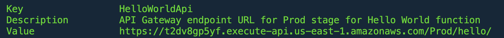
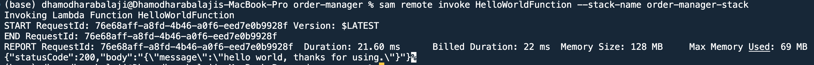
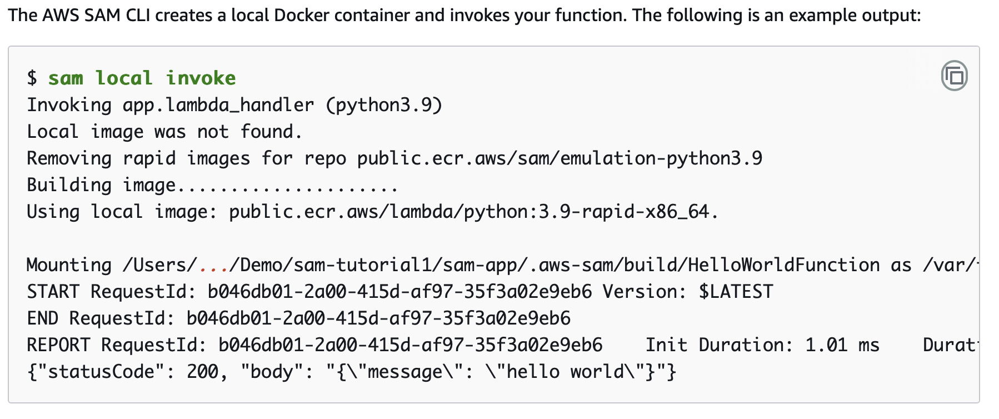
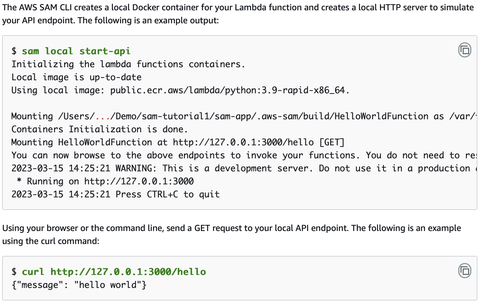

# AWS-Lambda-NodeJS-Boilerplate
Boilerplate code for AWS Lambda Function - using NodeJS runtime.

- API Gateway → Exposes endpoints for CRUD operations.
- AWS Lambda → Handles business logic for order management.
- Amazon DocumentDB (MongoDB-compatible) → Stores order data.
- Amazon SQS → Handles message queue processing.
- Amazon ElastiCache (Redis) → Caches order details for fast retrieval.
- AWS SAM (Serverless Application Model) → Defines infrastructure as code.

---

1️⃣ **template.yaml (AWS SAM Template)**
> Defines the Lambda functions, API Gateway, SQS, and ElastiCache.

1. Create ```mongodb``` test instance (preferably local), Configure your mongodb url at ```DB_URI``` in template.yaml
2. Create ```redis``` test instance at REDIS_HOST
```
docker run --name local-redis -p 6379:6379 -d redis

This command will start a Redis server on localhost at port 6379.

```


### Commands you can use next
- Create pipeline: ```cd order-manager && sam pipeline init --bootstrap```
- Validate SAM template: ```cd order-manager && sam validate```
- Test Function in the Cloud: ```cd order-manager && sam sync --stack-name {stack-name} --watch```


### Build project

```
sam build
```

### Deploy project

```
sam deploy --guided
```

**The AWS SAM CLI deploys your application by doing the following:**
- The AWS SAM CLI creates  ̑an Amazon S3 bucket and uploads your .aws-sam directory.
- The AWS SAM CLI transforms your AWS SAM template into AWS CloudFormation and uploads it to the AWS CloudFormation service.
- AWS CloudFormation provisions your resources.

### Output



Once the stack is created/updated successfully, then you will find the api gateway endpoint url. 

**To get the endpoint url:**

Use the ```sam list endpoints --output json``` command to get this information

**To Invoke the function**

1. Using curl
```
curl https://ets1gv8lxi.execute-api.us-west-2.amazonaws.com/Prod/hello/
{"message": "hello world"}
```

2. Using sam command

```sam remote invoke HelloWorldFunction --stack-name sam-app```




### Modify and sync your application to the AWS Cloud

> Use the AWS SAM CLI sam sync --watch command to sync local changes to the AWS Cloud.


In your command line, from the sam-app project directory, run the following:

```
sam sync --watch
```

> The AWS SAM CLI prompts you to confirm that you are syncing a development stack. Since the ```sam sync --watch``` command automatically deploys local changes to the AWS Cloud in real time, we recommend it for development environments only.


### Test your application locally

> Use the AWS SAM CLI sam local command to test your application locally. To accomplish this, the AWS SAM CLI creates a local environment using Docker. This local environment emulates the cloud-based execution environment of your Lambda function.

1. Create a local environment for your Lambda function and invoke it.
2. Host your HTTP API endpoint locally and use it to invoke your Lambda function.

In your command line, from the sam-app project directory, run the following:
```
sam local invoke

// To call a specific function
sam local invoke CreateOrderFunction --event events/createOrder.json

// To pass local env variables - only for local testing
sam local invoke CreateOrderFunction --event events/createOrder.json --env-vars env.json


```



### To host your API locally

In your command line, from the sam-app project directory, run the following:

```
sam local start-api
```




### Delete

In your command line, from the sam-app project directory, run the following:

```
sam delete
```

### References

- https://docs.aws.amazon.com/serverless-application-model/latest/developerguide/serverless-getting-started-hello-world.html